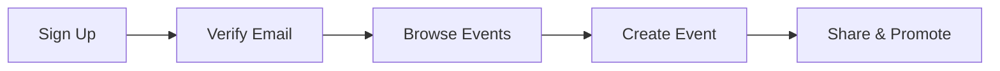

## Welcome to Kucska Bolka

Kucska Bolka is a modern university social media platform designed specifically for advertising university events and parties. Whether you're organizing a study group meetup, a campus festival, or a weekend party, Kucska Bolka helps you connect with your university community seamlessly.

Our platform provides an intuitive interface for creating, sharing, and discovering events, while ensuring all activities comply with university guidelines.

<Columns cols={3}>
  <Card title="Event Creation" icon="calendar" href="#event-creation">
    Easily create and promote university events with rich details and media.
  </Card>
  <Card title="Community Discovery" icon="users" href="#community-discovery">
    Discover events happening on your campus and connect with like-minded students.
  </Card>
  <Card title="Admin Oversight" icon="shield" href="#admin-oversight">
    University administrators can moderate and approve events to maintain safety.
  </Card>
</Columns>

## Key Features

Kucska Bolka offers a comprehensive set of features tailored for university life. You can create detailed event listings with photos, descriptions, and attendee limits. The platform includes real-time notifications, search filters by category, and integration with university calendars.

<Tabs>
  <Tab title="For Students" icon="user">
    Students can browse events by date, location, or interest. RSVP to events, invite friends, and leave reviews after attending.
    
    <Steps>
      <Step title="Sign Up" icon="user-plus">
        Create your account with university email verification.
      </Step>
      <Step title="Browse Events" icon="search">
        Use filters to find parties, study sessions, or sports events.
      </Step>
      <Step title="RSVP and Attend" icon="check-circle">
        Confirm your attendance and enjoy campus life.
      </Step>
    </Steps>
  </Tab>
  <Tab title="For Organizers" icon="settings">
    Event organizers can set privacy levels, manage guest lists, and track attendance.
    
    <CodeGroup tabs="JavaScript,Python">
      ````javascript
const eventData = {
  title: 'Campus Party 2024',
  description: 'Join us for an epic night',
  date: '2024-12-01T20:00:00Z',
  location: 'Student Union',
  maxAttendees: 200
};

fetch('/api/events', {
  method: 'POST',
  headers: { 'Content-Type': 'application/json' },
  body: JSON.stringify(eventData)
});
````
      ````python
import requests

event_data = {
    'title': 'Campus Party 2024',
    'description': 'Join us for an epic night',
    'date': '2024-12-01T20:00:00Z',
    'location': 'Student Union',
    'max_attendees': 200
}

response = requests.post('/api/events', json=event_data)
print(response.status_code)
````
    </CodeGroup>
  </Tab>
</Tabs>

<ExpandableGroup>
  <Expandable title="What makes Kucska Bolka different?" default-open="false">
    Unlike generic social media platforms, Kucska Bolka is built specifically for university environments. It includes features like automatic university email verification, location-based event discovery, and built-in moderation tools to ensure a safe and compliant community.
    
    <Callout kind="tip">Pro tip: Use the event categories to filter by academic vs. social events.</Callout>
  </Expandable>
  <Expandable title="Is it free to use?" default-open="false">
    Yes, Kucska Bolka is completely free for all university students and staff. We believe in fostering campus community without barriers.
  </Expandable>
</ExpandableGroup>

<Callout kind="info">Get started by creating your account and exploring events on your campus today.</Callout>

## Getting Started

To begin using Kucska Bolka, simply sign up with your university email address. Once verified, you can start browsing events or creating your own. Our platform is mobile-friendly, so you can manage events on the go.



Whether you're a freshman looking for your first campus party or a senior organizing farewell events, Kucska Bolka makes university social life more connected and exciting.